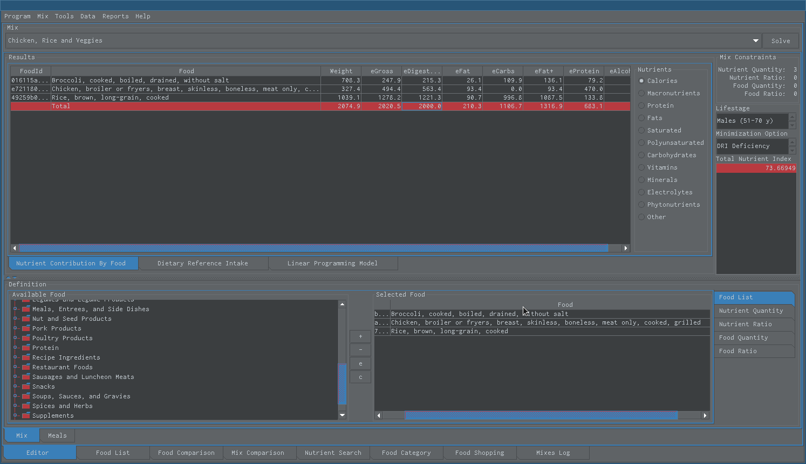

Projects
========

Snack Nutrition Software
------------------------

 Snack's ultimate purpose is to empower its users to make better nutrition decisions that will improve their diet, nutrition, health and quality of life.
	 
 It is a user-friendly software application that calculates the nutritional value of food mixtures.
	
 It is also a meal design tool and calculator that could facilitate achieving your health goals and objectives by first helping you understand your food intake and second by allowing you to create new food combinations that meet specific dietary requirements. 
	
 It is also a training program designed to find food combinations that minimize nutritional deficiencies. It lets you inexpensively experiment to get faster and better results so you can rapidly learn and improve.
	
 Its intended audience is anyone with interest in nutrition.
 
 We would like to invite all nutrition scientists, registered dietitians and nutrition / food / animal science students and food producers to use the application and share their insight.

 
.. index:: Snack

   
   Snack minimizes both the life stage specific Daily Reference Intake (DRI) deficiency and either or the DRI excess or the Tolerable Upper Intake Level (UL) excess of a food mixture. It calculates its nutritional value and its Total Nutrient Index (TNI) score.

+------------------+---------------------------------------------------------------+
| Stable Release   |August 01, 2025                                                |
+------------------+---------------------------------------------------------------+
| Repository       |https://github.com/xjrga/snack                                 |
+------------------+---------------------------------------------------------------+
| YouTube          |https://www.youtube.com/@SnackSoftware                         |
+------------------+---------------------------------------------------------------+
| Twitter          |https://x.com/SnackSoftware                                    |
+------------------+---------------------------------------------------------------+
| Written in       |java                                                           |
+------------------+---------------------------------------------------------------+
| Type             |nutrition                                                      |
+------------------+---------------------------------------------------------------+
| License          |gpl2                                                           |
+------------------+---------------------------------------------------------------+
| Download         |`snack-1530.zip <../releases/snack-1530.zip>`_                 |
+------------------+---------------------------------------------------------------+
| Signature        |`snack-1530.zip.asc <../releases/snack-1530.zip.asc>`_         |
+------------------+---------------------------------------------------------------+

.. toctree::
   :maxdepth: 1

   See more<snack/index>
   
----

Author
------
.. index:: Author

.. toctree::
   :maxdepth: 1

   See more<author/index>
