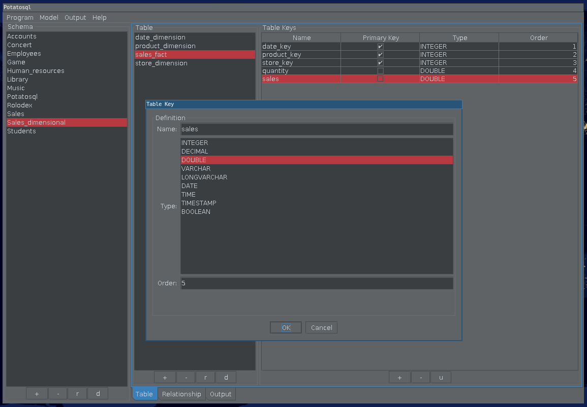

Potatosql: Learning Software For Database Design
================================================

Summary
-------

Potatosql is learning software for database design. The project's ultimate purpose is to help build java database application prototypes faster.

   Created table and added primary and data keys

----

Features
--------

.. toctree::
   :maxdepth: 1

   See more<features>

----

Screenshots
-----------

.. toctree::
   :maxdepth: 1

   See more<screenshots/index.rst>

----

Use Cases
---------

.. toctree::
   :maxdepth: 1

   See more<usecases>

----

Installation
------------

.. toctree::
   :maxdepth: 1

   See more<installation>

----

Design
------

.. toctree::
   :maxdepth: 1

   See more<design>

----

Other
-----

.. toctree::
   :maxdepth: 1

   See more<other>
