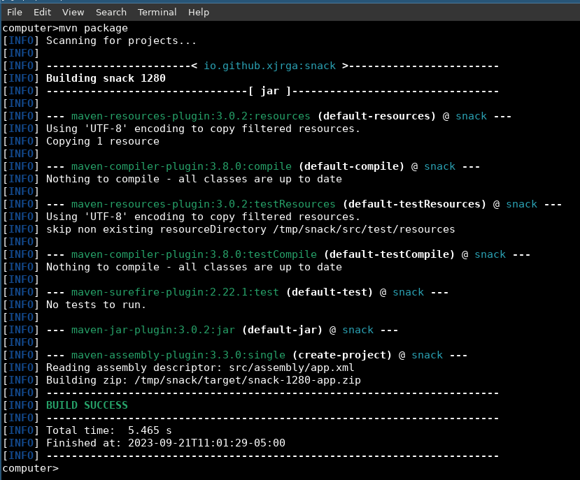

Cloning, Building and Running Snack
===================================

Create package
--------------
::

 git clone https://github.com/xjrga/snack.git
 cd snack
 mvn clean package

Run application
---------------
::

 cd target
 unzip snack-1280-app.zip
 cd snack-1280
 java -jar snack-1280.jar

----

