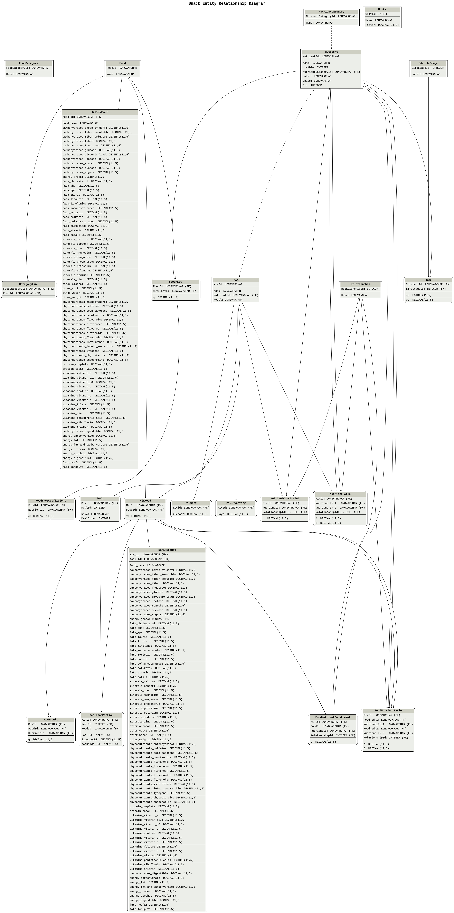

Design
======

   This is the relational database entity relationship (er) diagram.

* It shows relationships between database tables
* Source code was generated with PotatoSql and diagram with graphviz
* Diagram uses Idef1X Language notation although it is not a formal Idef1X diagram.
