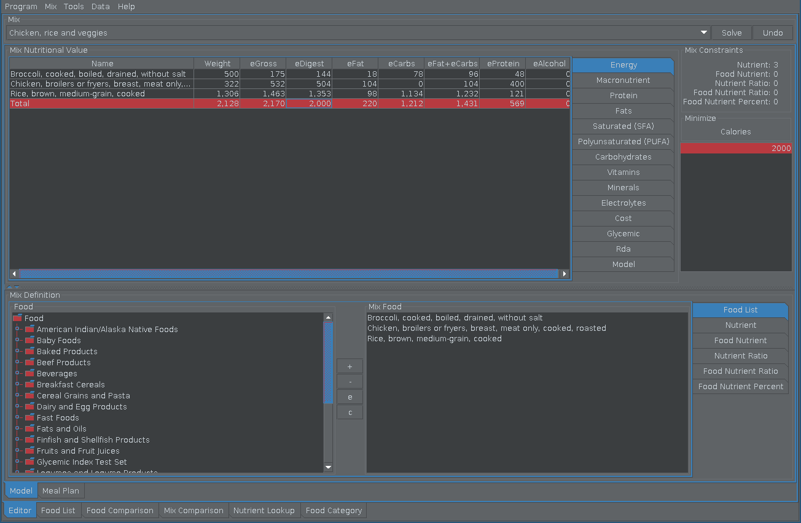

Snack: Diet Calculator and Meal Design Software
===============================================

Summary
-------

 Snack's ultimate purpose is to empower its users to make better nutrition decisions that will improve their diet, nutrition, health and quality of life.
 
 * It is a diet calculator and meal design software used for understanding a person's food intake.
 * It is a software program designed to find the lowest calorie or cost food combination. 
 * It lets user quickly, inexpensively and easily experiment creating different food combinations that have specific dietary requirements.
 * Its intended audience is anyone with interest in nutrition. 
 * Snack is now available to the whole world (7.674 billion people or 7674 million people).
 * Software can be downloaded and used for no money although author considers it priceless.
 * Nutrition scientists, registered dietitians and nutrition / food / animal science students and food producers are especially invited to use it and share their insight

----

Features
--------

.. toctree::
   :maxdepth: 1

   See more<features>

----

Screenshots
-----------

.. toctree::
   :maxdepth: 1

   See more<screenshots/index.rst>

----

Use Cases
---------

.. toctree::
   :maxdepth: 1

   See more<usecases/index.rst>

----

Installation
------------

.. toctree::
   :maxdepth: 1

   See more<installation>

----

Design
------

.. toctree::
   :maxdepth: 1

   See more<design/index.rst>

----

Bibliography
------------

.. toctree::
   :maxdepth: 1

   See more<bibliography/index.rst>

----

Cloning, building and running
-----------------------------

.. toctree::
   :maxdepth: 1

   See more<cloning/index.rst>

----

Constraint types
----------------

.. toctree::
   :maxdepth: 1

   See more<constraints/index.rst>

----

Data exchange
-------------

.. toctree::
   :maxdepth: 1

   See more<exchange/index.rst>

----

Definitions
-----------

.. toctree::
   :maxdepth: 1

   See more<definitions/index.rst>

----

Learning Activities
-------------------

.. toctree::
   :maxdepth: 1

   See more<learning/index.rst>

----

News
----

.. toctree::
   :maxdepth: 1

   See more<news/index.rst>

----

Comments
--------

.. toctree::
   :maxdepth: 1

   See more<comments/index.rst>

----

Usage & Tips
------------

.. toctree::
   :maxdepth: 1

   See more<tips/index.rst>

----

Additional Food Items
---------------------

* `See more <../../foodsite/index.html>`_

----

Model
-----

.. toctree::
   :maxdepth: 1

   See more<model/index.rst>
