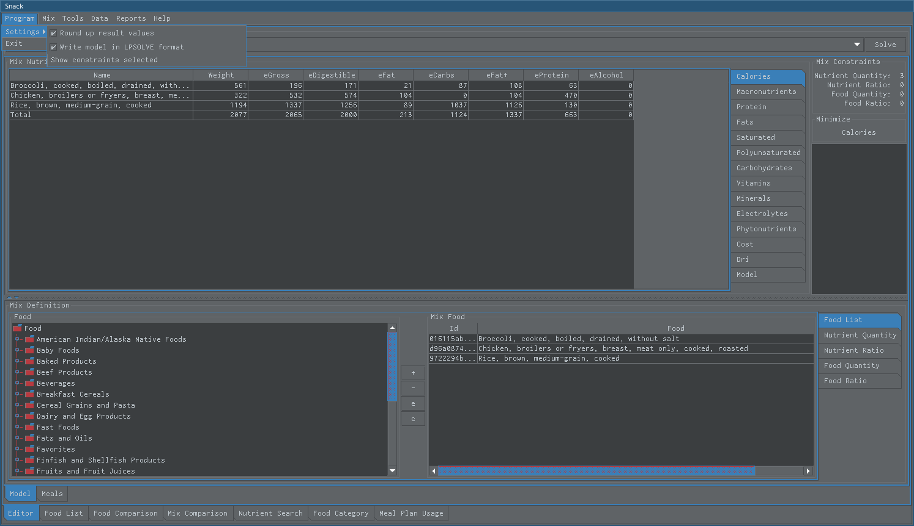
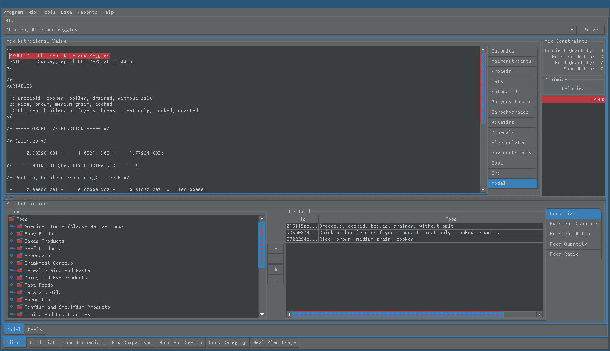
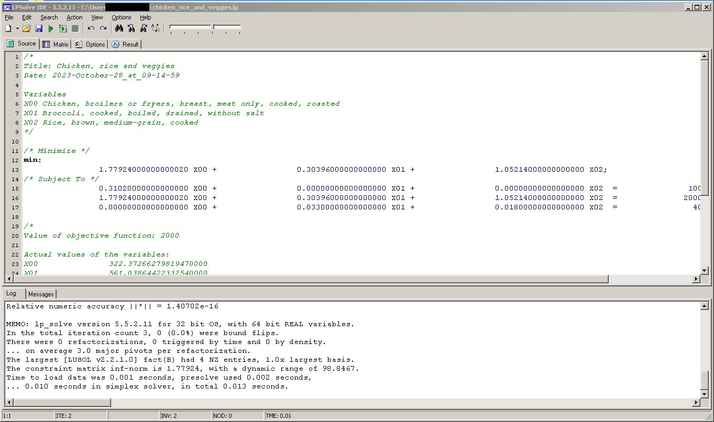
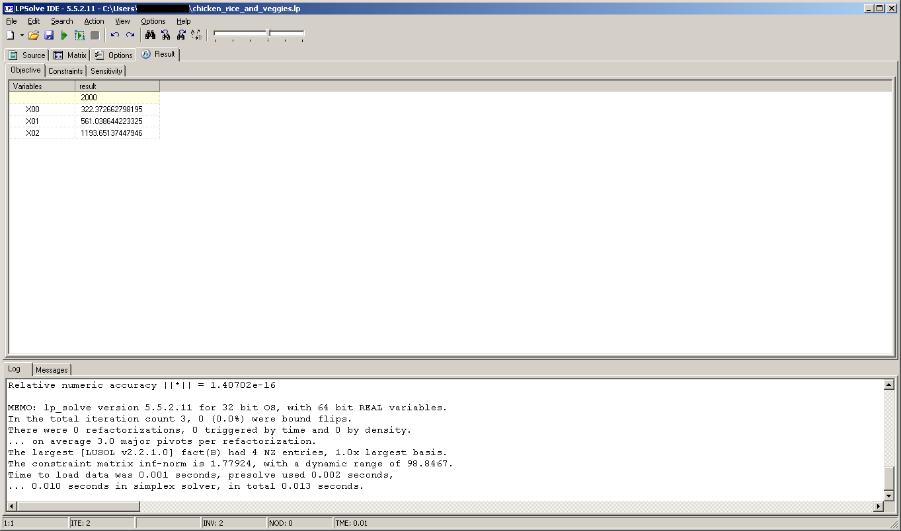

Model
=====

Writing Model to File
---------------------

   A model file will be written to file every time a Snack finds a solution and you can find it in the models directory

-----

The Linear Program Model View
-----------------------------

   This is the linear program model view

-----

LPSOLVE LP format example
-------------------------

An Example File

*  `Chicken, Rice and Veggies model file for lpsolve <../../../files/other/snack_lpsolve_1743971125.lp>`_

For example, user could use the following command to solve problem in linux

* lp_solve -piv1 -s1 -S3 chicken_rice_and_veggies.lp

The Solution File

*  `Chicken, Rice and Veggies model solution <../../../files/other/snack_lpsolve_1743971125.lp.sol>`_

On windows, user can use lpsolve for windows

   The chicken, rice and veggies mix problem on lpsolve for windows

   The result of the chicken, rice and veggies mix problem using lpsolve for windows

* `https://sourceforge.net/projects/lpsolve <https://sourceforge.net/projects/lpsolve>`_
