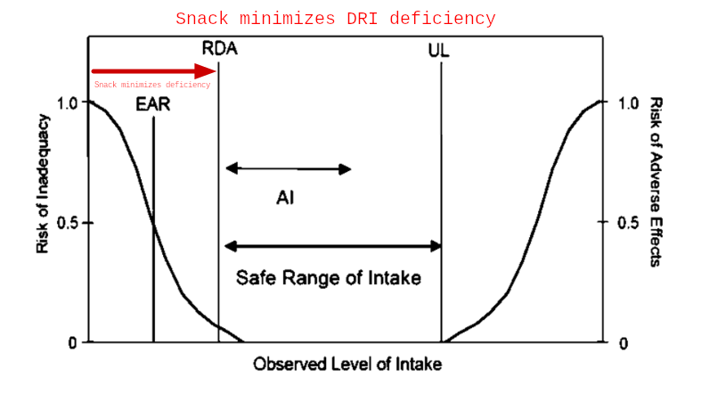
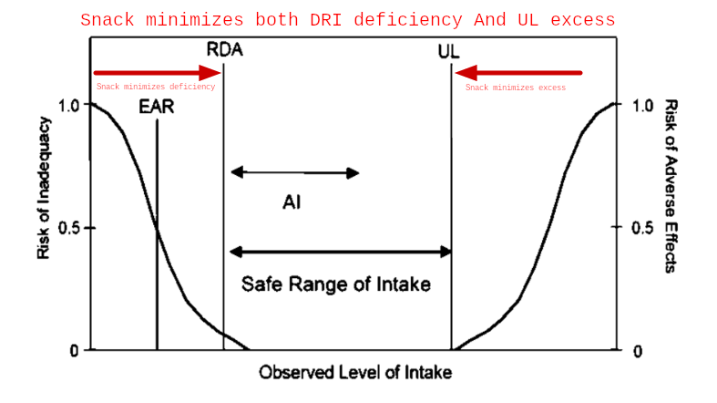
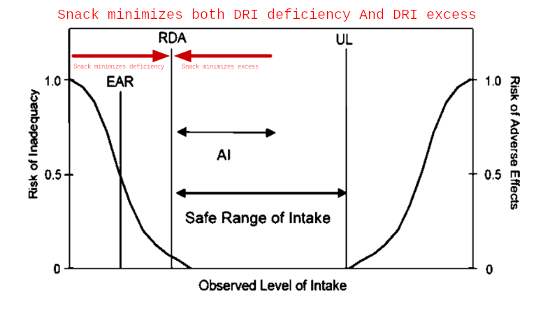

Objective
=========

What we want is to create a food mixture that meets specific dietary requirements. For example, it should meet the Dietary Reference Intake (DRI) and it should keep our saturated fat and sodium intake low.

There are three minimization options that we can use. These options act upon the food mixture in different ways to control its nutritional value. The nutrients that participate in the optimization process are calcium, magnesium, potassium, choline, and vitamins A, C, D and E which are the total nutrient index (TNI).

Our three options are:

 * Minimize DRI deficiency
 * Minimize DRI deficiency and UL excess
 * Minimize DRI deficiency and DRI excess
 
In some cases the the TNI score will very similar when using the different minimization options in others, not. We use dietary supplements such as multivitamins and fish oil to fill-in the nutritional gaps and enhance our food mixture.
 
 
Minimize DRI Deficiency
-----------------------

   
   Our first option is to minimize the life stage specific Daily Reference Intake (DRI) deficiency of a food mixture. This option maximizes the Total Nutrient Index (TNI) score. It tries to meet the DRI without any concerns for the Tolerable Upper Intake Level (UL).
   

Minimize DRI Deficiency And Tolerable Upper Intake Level (UL) Excess
--------------------------------------------------------------------

   
   Our second option is to minimize both the life stage specific Daily Reference Intake (DRI) deficiency and the Tolerable Upper Intake Level (UL) excess. This option tries to meet the DRI but also pays attention of not going to far beyond for the Tolerable Upper Intake Level (UL). 
   
   
Minimize DRI Deficiency And DRI Excess
--------------------------------------

   
   Our last option is to minimize both the life stage specific Daily Reference Intake (DRI) deficiency and the Daily Reference Intake (DRI) excess. This option keeps our food mixture nutritional value as close to the DRI as possible both on the deficiency and excess side of it.

   