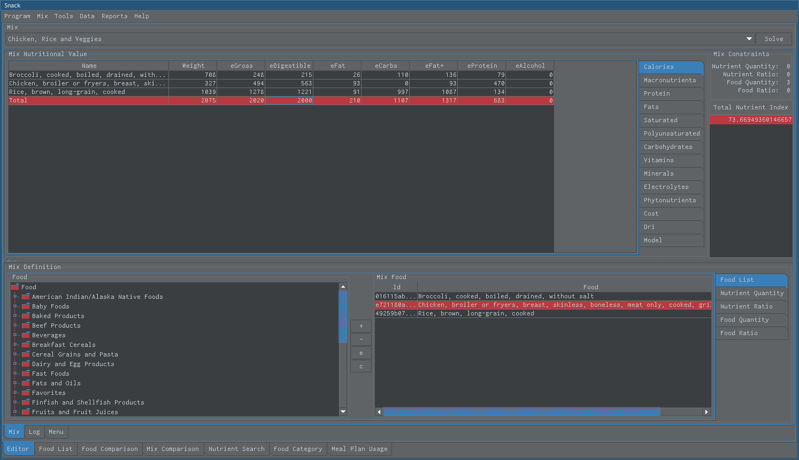

Snack Calories
==============

   This is the calories summary view

* Control-h maximizes upper panel
* Control-l maximizes bottom panel
* Control-m sets upper and bottom panel in normal position
* Pressing Delete on 'Calories' list clears it
* Solve model often to see latest results
