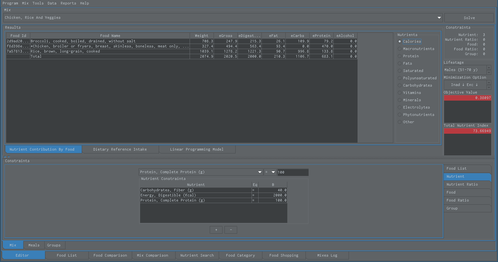
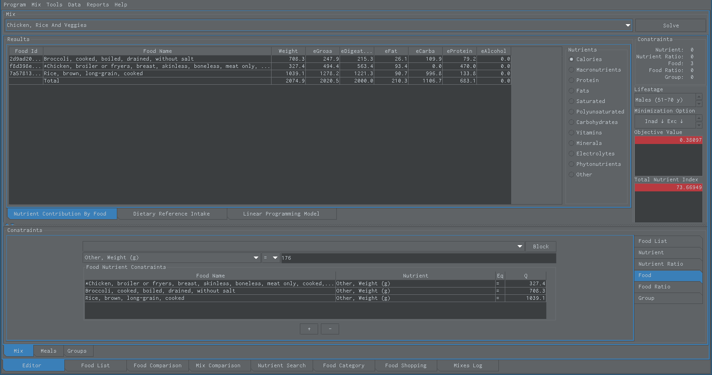

Snack Nutrient Constraint
=========================

   This is the nutrient constraint which is used to put a quantity limit on a specific nutrient.

----

Snack Food Constraint
=====================

   This is the food constraint which is used to put a quantity limit on a specific food.