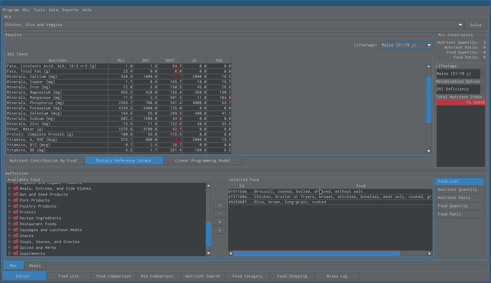

Snack Dri
=========

   This is the daily reference intake (DRI) summary view. The pink and red numbers are nutrient deficiencies at the Percent of DRI (%DRI) column. The red numbers are part of the total nutrient index (TNI). 

-----

.. figure:: images/25.png
   :alt: find nutrient containing foods action
   :align: center
   :target: ../../_images/25.png

   When looking at the daily reference intake we may ask ourselves how we can meet those requirements. If you right click on one of those nutrients you can get list of food items that provide it. 
