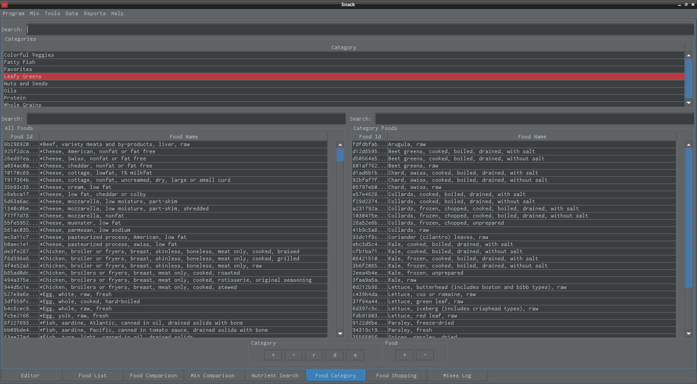
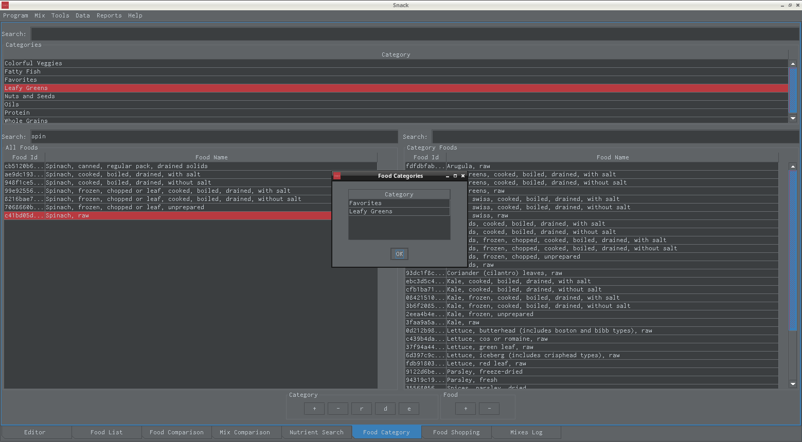

Snack Food Categories
=====================

   Create special food categories to easily find your food items. For example, you can have a "Leafy Greens" or "Favorites" category.

----

.. figure:: ../images/25a.png
   :alt: calories summary view
   :align: center
   :target: ../../_images/25a.png
   
   Right click on a food item to see what food categories it belongs to.
   
----

   
   Spinach is in the "Favorites" and "Leafy Greens" categories.
      
