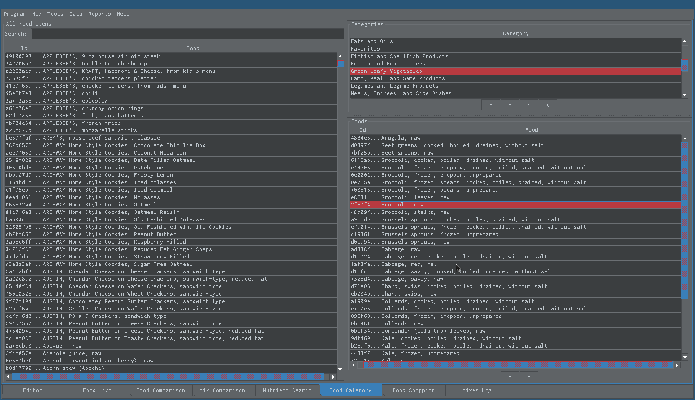

Snack Food Categories
=====================

   Create special food categories to easily find your food items. For example, you can have a "Green Leafy Vegetables" or "Favorites" category.

----

.. figure:: images/22a.png
   :alt: food categories view
   :align: center
   :target: ../../_images/22a.png
   
   Right click on a food item to see what food categories it belongs to.
   
----

.. figure:: images/22b.png
   :alt: food categories view
   :align: center
   :target: ../../_images/22b.png

   Cabbage is part of the "Vegetables and Vegetable Products" and "Green Leafy Vegetables" Categories.
      
