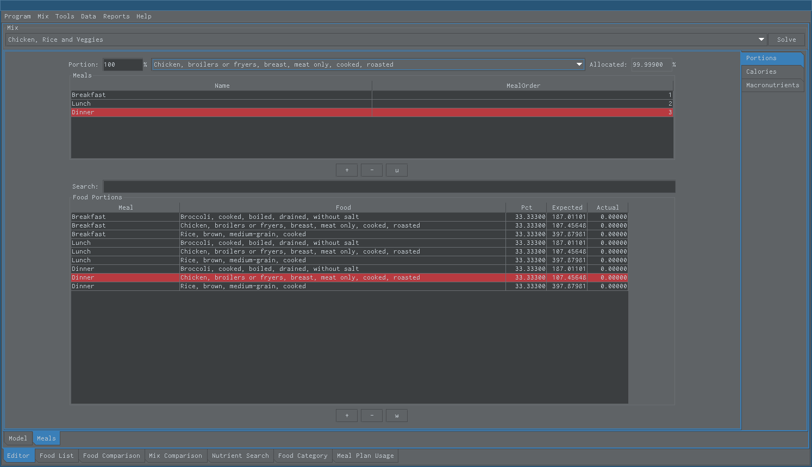

Snack Meal Portion
==================

This is meal plan portion area where user can create a meal plan schedule. User can add and delete multiple meal food portions at a time. Percentage allocated is percentage specified divided by number of meals. Snack will not prevent your from allocating more than there is. Check total percent to see if more than 100% was allocated.

