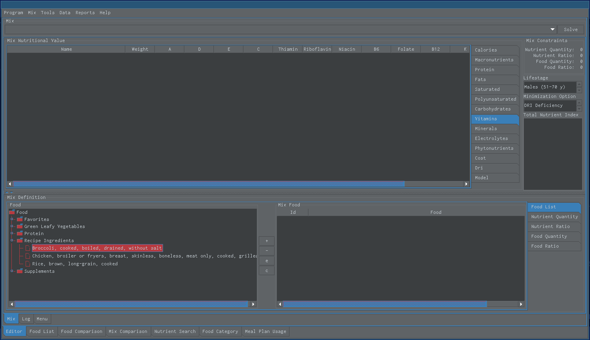

Create Diet Using Nutrient Quantity Constraints
===============================================

   Nutrient quantity constraints can be used to create a food mix that meets specific dietary requirement, for example, a minimum amount of fiber in the diet. Nutrient quantity constraints specify the amount of nutrient a food mix should have.