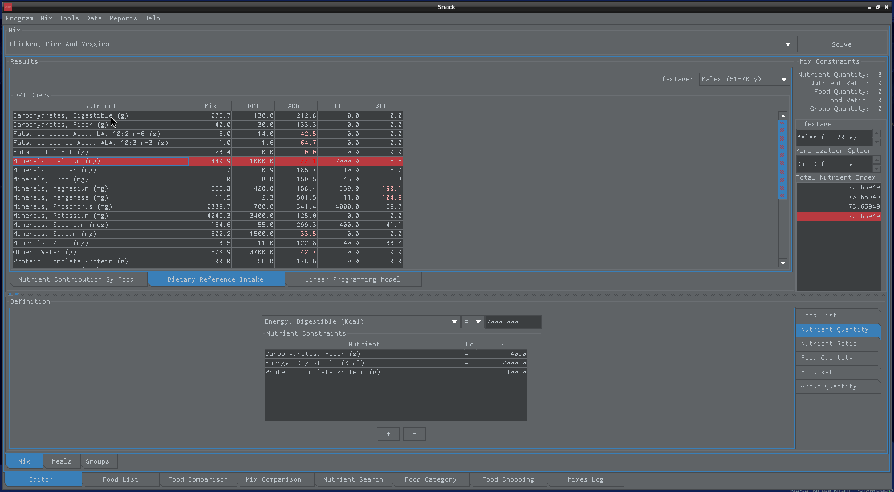

Nutrient Search
===============

   
   This is how we search for a food item that contains calcium.
   
If we find that our dietary reference index (dri) score for a specific nutrient is low we can search for food items that contain that missing nutrient.
   
To get a list of food items that could supply that missing nutrient, we can right click on the missing nutrient at the dri score tab and that will create the list of food items at the nutrient search tab.
   
In this specific example we see that our calcium is low so we search for food items that supply calcium, we then add one or more of those food items to our calcium deficient mix and recalculate the total nutrient index score.
